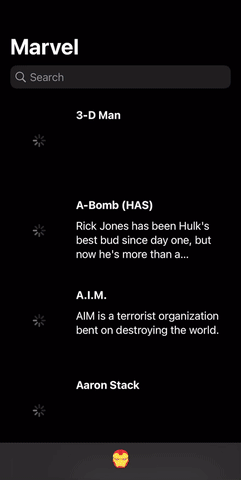

# Marvel

    
    
    

Pet project for marvel app based on SwiftUI with MVVM architecture

## Network

Network module [generated](https://github.com/c-villain/Marvel/blob/main/swagger/generate-cmd.sh) with [openapi-generator](https://github.com/OpenAPITools/openapi-generator) using [swagger 2.0-version](https://github.com/c-villain/Marvel/blob/main/swagger/swagger.yaml) [converted](https://github.com/c-villain/Marvel/blob/main/swagger/2json.sh) to [openapi format](https://github.com/c-villain/Marvel/blob/main/swagger/openapi.yaml)

## Router

Use coordinator pattern based on [FlowStacks](https://github.com/johnpatrickmorgan/FlowStacks)

## Obfuscator

Add [obfuscation](https://en.wikipedia.org/wiki/Obfuscation_(software)) for safe storing private keys for API

